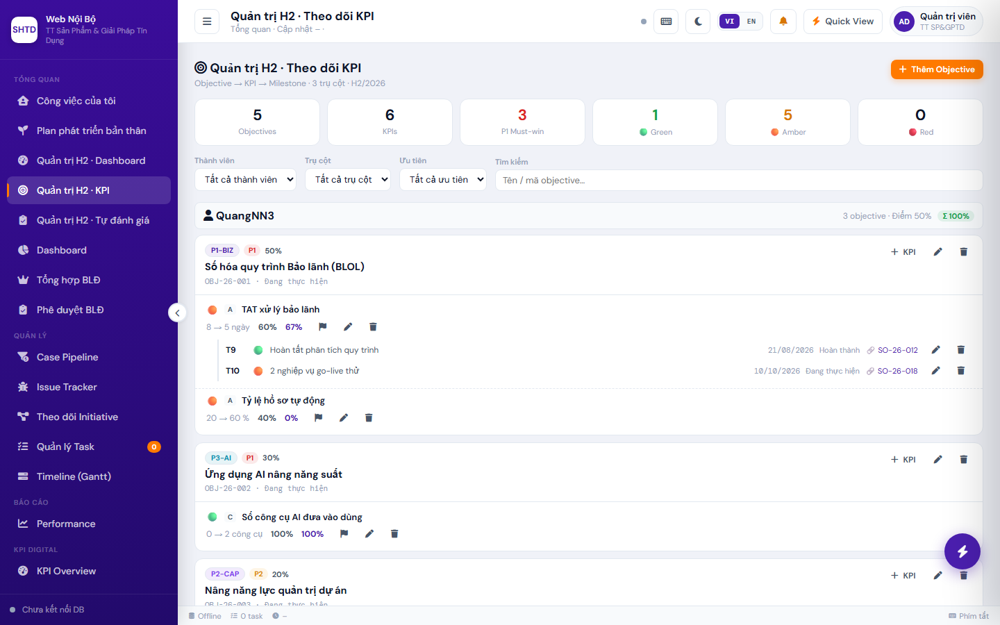
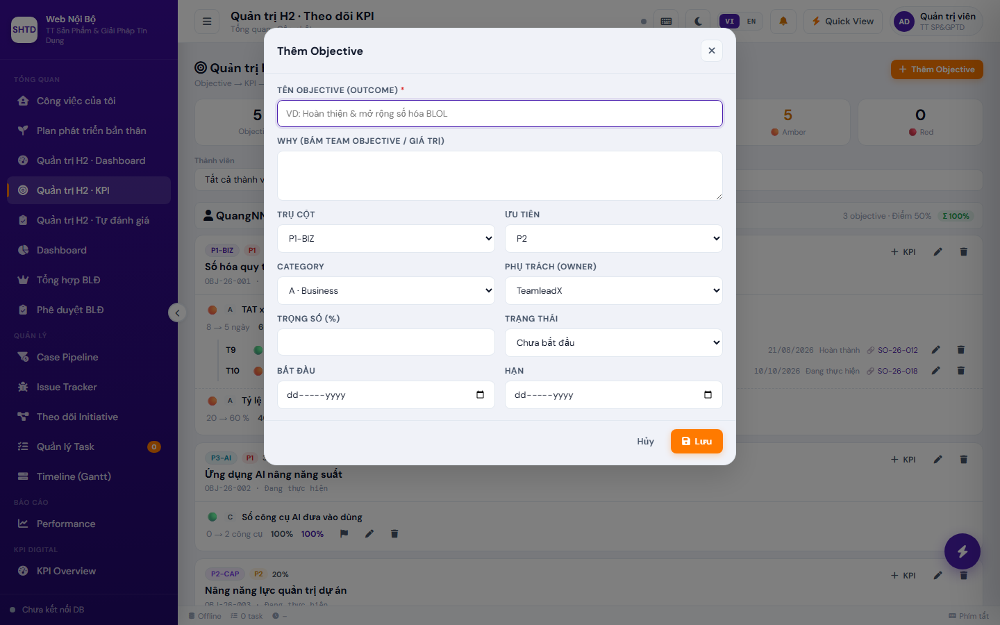
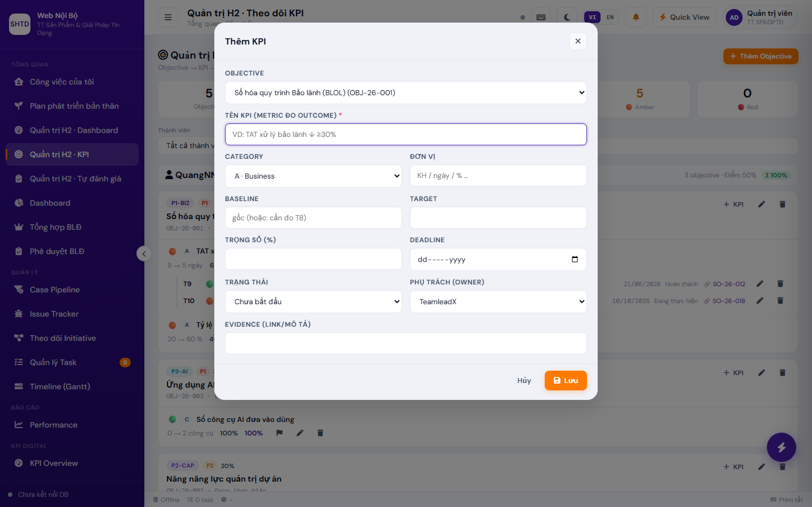
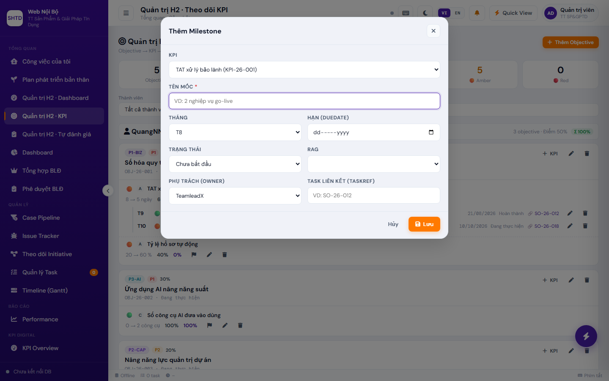
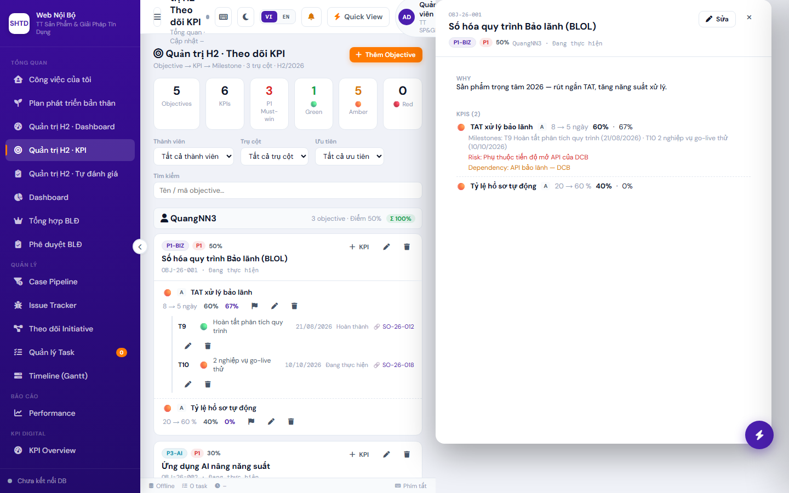
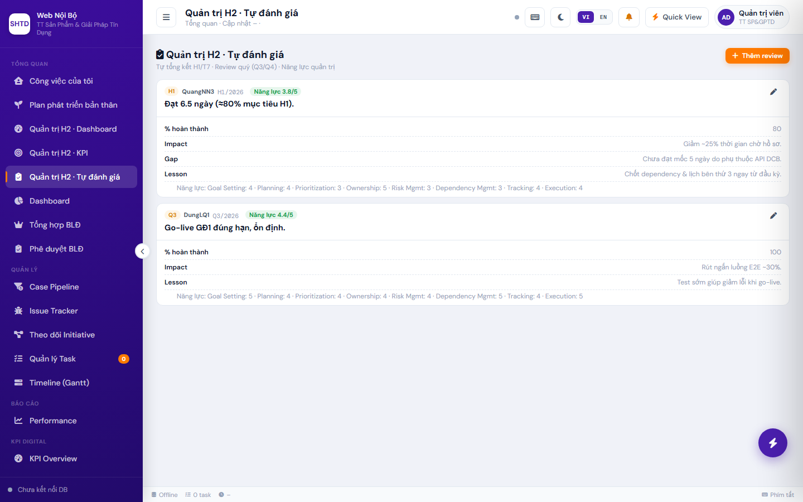
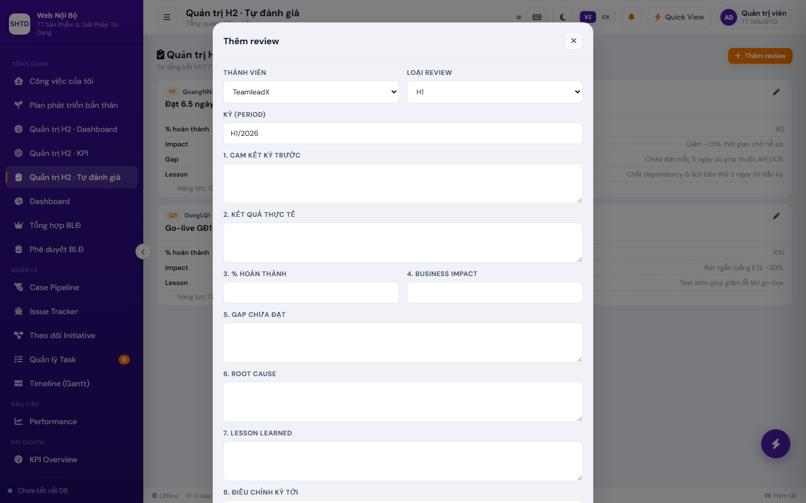
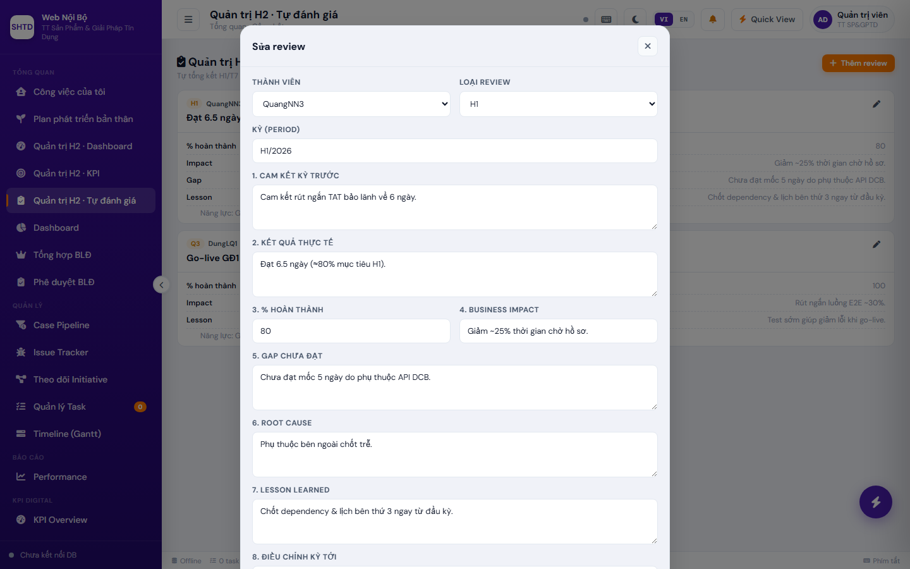
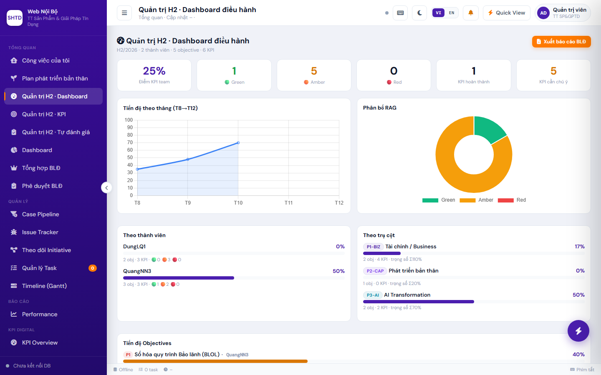
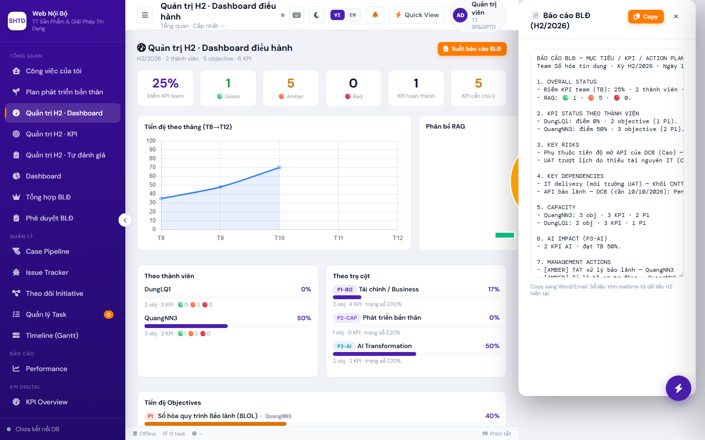

# HƯỚNG DẪN SỬ DỤNG — QUẢN TRỊ H2 · KPI
### Team Số hóa tín dụng — Trung tâm Sản phẩm & Giải pháp Tín dụng

> Module **Quản trị H2** nằm trong Web Nội Bộ (SHTD Dashboard), phiên bản **v6.39** trở lên.
> Nếu không thấy menu hoặc giao diện cũ: nhấn **Ctrl + Shift + R** để tải lại (xóa cache), kiểm tra badge phiên bản góc phải là `v6.39-h2-dashboard-review-...`.

---

## Mục lục
1. [Tổng quan & khái niệm](#1-tổng-quan--khái-niệm)
2. [Phân quyền — ai làm được gì](#2-phân-quyền--ai-làm-được-gì)
3. [Màn hình 1 — Theo dõi KPI (Tracker)](#3-màn-hình-1--theo-dõi-kpi-tracker)
   - [3.1 Thêm Objective](#31-thêm-objective-mục-tiêu)
   - [3.2 Thêm KPI](#32-thêm-kpi)
   - [3.3 Thêm Milestone (mốc tháng)](#33-thêm-milestone-mốc-tháng)
   - [3.4 Xem chi tiết Objective](#34-xem-chi-tiết-objective)
   - [3.5 Sửa / Xóa](#35-sửa--xóa)
4. [Màn hình 2 — Tự đánh giá (Self-review)](#4-màn-hình-2--tự-đánh-giá-self-review)
5. [Màn hình 3 — Dashboard điều hành & Xuất báo cáo BLĐ](#5-màn-hình-3--dashboard-điều-hành--xuất-báo-cáo-blđ)
6. [Cách hệ thống tự tính RAG, %, Điểm](#6-cách-hệ-thống-tự-tính-rag--điểm)
7. [Quy tắc bắt buộc & mẹo](#7-quy-tắc-bắt-buộc--mẹo)
8. [Câu hỏi thường gặp (FAQ)](#8-câu-hỏi-thường-gặp-faq)

---

## 1. Tổng quan & khái niệm

Module gồm **3 menu** ở nhóm "Tổng quan" của thanh trái:

| Menu | Dùng để | Ai dùng nhiều |
|---|---|---|
| **Quản trị H2 · Dashboard** | Nhìn tổng thể sức khỏe KPI toàn team, xuất báo cáo BLĐ | Teamlead / BLĐ |
| **Quản trị H2 · KPI** | Khai báo & theo dõi Objective → KPI → Milestone | Teamlead (khai báo) · Member (xem) |
| **Quản trị H2 · Tự đánh giá** | Member tự tổng kết H1/quý + tự chấm năng lực | Mọi thành viên |

**Hệ cấp khái niệm (rất quan trọng — hiểu đúng để không nhập nhầm):**

```
Thành viên (Member)
   └── Objective  — MỤC TIÊU lớn (VD "Số hóa quy trình bảo lãnh")   ← có Trọng số %
          └── KPI — CHỈ SỐ đo được (VD "TAT xử lý ≤ 5 ngày")        ← có Baseline→Target, Trọng số %
                 └── Milestone — MỐC theo tháng (VD "T10: 2 nghiệp vụ go-live")  ← có RAG
```

**3 trụ cột (Pillar):**
- **P1-BIZ** — Tài chính / Business (giá trị kinh doanh)
- **P2-CAP** — Phát triển bản thân (năng lực)
- **P3-AI** — AI Transformation

**Ưu tiên:** P1 (Must-win, tối đa 2–3/người) · P2 · P3.

---

## 2. Phân quyền — ai làm được gì

| Thao tác | Teamlead / Admin | Member (User) |
|---|---|---|
| Xem toàn bộ Objective/KPI/Milestone của cả team | ✅ | ✅ |
| **Thêm / Sửa / Xóa** Objective, KPI, Milestone | ✅ | ❌ (chỉ xem) |
| Xem Dashboard + Xuất báo cáo BLĐ | ✅ | ✅ |
| **Tạo / Sửa review của chính mình** | ✅ | ✅ |
| Xem review của **người khác** | ✅ (thấy tất cả) | ❌ (chỉ thấy của mình) |
| Chấm năng lực member khác | ✅ | ❌ |

> Với Member, các nút ✏️ (Sửa) / 🗑 (Xóa) / ➕ trên màn hình KPI **sẽ không hiển thị** — đây là bản chỉ-đọc, đúng thiết kế.

---

## 3. Màn hình 1 — Theo dõi KPI (Tracker)

Mở menu **Quản trị H2 · KPI**.



**Bố cục:**
- **Thanh thống kê (6 ô)**: tổng Objectives · KPIs · P1 Must-win · số KPI 🟢 Green · 🟠 Amber · 🔴 Red.
- **Bộ lọc**: theo Thành viên · Trụ cột · Ưu tiên · ô Tìm kiếm (tên/mã).
- **Danh sách nhóm theo thành viên**: mỗi người có dòng tiêu đề ghi *số objective · Điểm % · tổng trọng số Σ%* (badge **Σ100%** xanh nếu đủ 100%, **⚠** vàng nếu chưa đủ).
- Mỗi **thẻ Objective** hiển thị trụ cột, ưu tiên, trọng số, tên, mã, trạng thái; bên dưới là danh sách **KPI**; mỗi KPI có thể có các dòng **Milestone**.
- Nút trên thẻ (chỉ Teamlead): **➕ KPI** · **✏️** (sửa objective) · **🗑** (xóa). Trên mỗi KPI: **🚩** (thêm mốc) · **✏️** · **🗑**.

### 3.1 Thêm Objective (mục tiêu)

1. Bấm nút **➕ Thêm Objective** (góc phải trên).
2. Điền form:



| Trường | Ý nghĩa / gợi ý |
|---|---|
| **Tên Objective** | Mục tiêu lớn. VD: *"Hoàn thiện & mở rộng số hóa BLOL"* |
| **Why (Tại sao)** | Lý do chiến lược — vì sao mục tiêu này quan trọng |
| **Trụ cột** | P1-BIZ / P2-CAP / P3-AI |
| **Ưu tiên** | P1 / P2 / P3 (P1 tối đa 2–3/người) |
| **Category** | A·Business · B·Delivery · C·AI/Improve · D·Capability |
| **Phụ trách (Owner)** | Thành viên sở hữu mục tiêu |
| **Trọng số (%)** | Tỷ trọng của mục tiêu này trong 100% của người đó |
| **Trạng thái** | Chưa bắt đầu / Đang thực hiện / Hoàn thành / Tạm dừng / Blocked |
| **Bắt đầu · Hạn** | Chọn ngày (lịch) |

3. Bấm **Lưu**. Objective xuất hiện **ngay** trong nhóm của người phụ trách (không cần chờ đồng bộ).

> **Lưu ý trọng số:** tổng trọng số các Objective của **một người phải = 100%**. Nếu chưa đủ, badge cạnh tên người sẽ hiện **⚠** vàng.

### 3.2 Thêm KPI

Trên thẻ Objective, bấm **➕ KPI** (hoặc mở KPI có sẵn để sửa).



| Trường | Ý nghĩa / gợi ý |
|---|---|
| **Objective** | KPI này thuộc mục tiêu nào (đã chọn sẵn nếu bấm từ thẻ) |
| **Tên KPI** | Chỉ số đo được. VD: *"TAT xử lý bảo lãnh ↓ ≥30%"* |
| **Category** | A / B / C / D (giống objective) |
| **Đơn vị** | ngày / % / hồ sơ / công cụ … |
| **Baseline** | Giá trị gốc trước khi cải tiến (nếu chưa đo được: ghi *"cần đo T8"*) |
| **Target** | Giá trị mục tiêu cần đạt |
| **Trọng số (%)** | Tỷ trọng KPI trong Objective (các KPI cùng objective nên cộng = 100%) |
| **Deadline** | Hạn hoàn thành KPI (dùng để tính RAG) |
| **Trạng thái** | Chưa bắt đầu / Đang thực hiện / Hoàn thành … |
| **Phụ trách (Owner)** | Người chịu trách nhiệm KPI |
| **Evidence** | Link/mô tả bằng chứng (log, báo cáo…) |

> **KPI thiếu chuẩn** (thiếu Target/Unit/Weight/Owner/Category) sẽ bị gắn cờ **⚠️** màu cam trên dòng KPI để nhắc bổ sung.

### 3.3 Thêm Milestone (mốc tháng)

Trên dòng KPI, bấm biểu tượng **🚩** (Thêm mốc).



| Trường | Ý nghĩa |
|---|---|
| **KPI** | Mốc thuộc KPI nào |
| **Tên mốc** | VD: *"2 nghiệp vụ go-live"* |
| **Tháng** | T8 → T12 (hệ tự suy Quý: T8–T9 = Q3, T10–T12 = Q4) |
| **Hạn (DueDate)** | Ngày đến hạn của mốc |
| **Trạng thái** | Chưa bắt đầu / Đang thực hiện / Hoàn thành … |
| **RAG** | (Tùy chọn) 🟢 GREEN / 🟠 AMBER / 🔴 RED — nếu để trống hệ **tự tính** |
| **Phụ trách** | Người phụ trách mốc |
| **Task liên kết (TaskRef)** | Mã Task bên "Quản lý Task" (VD `SO-26-012`) — liên kết mềm, không bắt buộc |

### 3.4 Xem chi tiết Objective

Bấm vào **phần đầu thẻ Objective** (vùng tên) để mở popup chi tiết chỉ-đọc: WHY, danh sách KPI kèm milestone/risk/dependency, % đạt, RAG.



Trong popup, Teamlead có nút **✏️ Sửa** để mở nhanh form chỉnh sửa. Nhấn **Esc** hoặc **✕** để đóng.

### 3.5 Sửa / Xóa

- **Sửa**: bấm **✏️** trên thẻ Objective / dòng KPI / dòng Milestone → form mở với dữ liệu cũ → sửa → **Lưu**.
- **Xóa**: bấm **🗑** → hộp xác nhận. Xóa Objective **giữ lại KPI con** nhưng chúng mất liên kết (cảnh báo số KPI trước khi xóa). Xóa KPI/Milestone xóa đúng mục đó.
- Thao tác cập nhật **tức thì** trên màn hình; nếu ghi lên máy chủ lỗi (mất mạng) sẽ có **toast cảnh báo** — dữ liệu vẫn giữ cục bộ.

---

## 4. Màn hình 2 — Tự đánh giá (Self-review)

Mở menu **Quản trị H2 · Tự đánh giá**. Dùng cuối **H1/T7** và cuối **quý (Q3/Q4)** để member tự tổng kết + tự chấm 8 chiều năng lực quản trị.



- **Member** chỉ thấy review **của mình**; **Teamlead/Admin** thấy **tất cả** và chọn được người.
- Mỗi thẻ review hiển thị: loại (H1/Q3/Q4), người, kỳ, badge **Năng lực TB (…/5)**, và tóm tắt % hoàn thành / Impact / Gap / Lesson.

**Thêm / sửa review:** bấm **➕ Thêm review** (hoặc **✏️** trên thẻ của mình).



Form gồm:
- **Thành viên** (Teamlead chọn được; member khóa vào chính mình) · **Loại review** (H1/Q3/Q4) · **Kỳ** (VD `H1/2026`).
- **8 câu hỏi tổng kết:**
  1. Cam kết kỳ trước
  2. Kết quả thực tế
  3. % hoàn thành
  4. Business impact
  5. Gap chưa đạt
  6. Root cause (nguyên nhân gốc)
  7. Lesson learned (bài học)
  8. Điều chỉnh kỳ tới
- **8 chiều năng lực quản trị** (chấm 1–5): Goal Setting · Planning · Prioritization · Ownership · Risk Mgmt · Dependency Mgmt · Tracking · Execution.

Ví dụ một review đã điền đầy đủ:



Bấm **Lưu** — thẻ review cập nhật ngay, badge "Năng lực TB" = trung bình 8 điểm năng lực.

---

## 5. Màn hình 3 — Dashboard điều hành & Xuất báo cáo BLĐ

Mở menu **Quản trị H2 · Dashboard**. Thiết kế "đọc trong ≤3 phút" cho Teamlead/BLĐ.



**Đọc từ trên xuống:**
1. **6 thẻ tổng**: Điểm KPI team (TB %) · 🟢 Green · 🟠 Amber · 🔴 Red · KPI hoàn thành · KPI cần chú ý.
2. **Biểu đồ**: đường *Tiến độ theo tháng (T8→T12)* + tròn *Phân bố RAG*.
3. **Theo thành viên** / **Theo trụ cột**: thanh tiến độ + số KPI theo màu.
4. **Tiến độ Objectives**: từng mục tiêu và % đạt (màu theo RAG).
5. **🚨 Top Risks** / **🔗 Top Dependencies**: rủi ro & phụ thuộc đang mở.
6. **⚖️ Capacity**: bảng số objective/KPI/P1 mỗi người — ai **quá tải** (P1 > 3 hoặc >5 objective) được tô nền + cờ **⚠ Quá tải**.
7. **🤖 AI Impact**: tổng hợp riêng các KPI trụ cột P3-AI.
8. **📌 Management Actions**: danh sách KPI Amber/Red + mốc quá hạn cần Teamlead can thiệp.

### Xuất báo cáo BLĐ

Bấm **📄 Xuất báo cáo BLĐ** (góc phải trên). Hệ sinh sẵn báo cáo văn bản 8 mục (Overall status → KPI theo thành viên → Risks → Dependencies → Capacity → AI Impact → Management Actions → BLĐ Support Required) với số liệu **tính realtime**.



Bấm **Copy** rồi dán thẳng sang **Word / Email** để gửi BLĐ.

---

## 6. Cách hệ thống tự tính RAG & Điểm

Bạn **không cần nhập tay** màu RAG hay % đạt — hệ suy ra tự động (nhưng nếu member ghi RAG ở tracking thì tôn trọng giá trị đó):

- **% đạt của 1 KPI (Achievement):** suy từ `Baseline → Target` so với `Actual` gần nhất. Hỗ trợ cả hướng *giảm tốt* (TAT, thời gian) lẫn *tăng tốt* (tỷ lệ, số lượng). Nếu chưa có số → suy theo % Progress, cuối cùng fallback nhị phân theo Trạng thái (Hoàn thành = 100%).
- **RAG của 1 KPI:**
  - 🔴 **RED**: quá hạn Deadline mà chưa đạt 100%.
  - 🟠 **AMBER**: sắp đến hạn (≤14 ngày) chưa đạt, **hoặc** % đạt thấp hơn ngưỡng (mặc định < 80%).
  - 🟢 **GREEN**: đạt ≥100% hoặc còn trong ngưỡng an toàn.
- **% đạt Objective** = trung bình có trọng số các KPI con.
- **Điểm 1 thành viên** = Σ(Trọng số Objective% × %đạt Objective) ÷ 100.
- **Điểm team** = trung bình điểm các thành viên.

---

## 7. Quy tắc bắt buộc & mẹo

- ✅ **Tổng trọng số Objective mỗi người = 100%** (badge ⚠ nếu lệch).
- ✅ **Tối đa 2–3 P1/người** — vượt sẽ báo **Quá tải** ở Capacity.
- ✅ **Mỗi KPI cần đủ**: Target, Đơn vị, Trọng số, Owner, Category — thiếu sẽ có cờ ⚠️.
- 💡 Baseline chưa đo được thì ghi *"cần đo T8"* thay vì bỏ trống.
- 💡 Liên kết **TaskRef** để mốc H2 nối tới công việc thực trong "Quản lý Task".
- 💡 Cập nhật là **tức thì** (optimistic) — không có toast "thành công"; **chỉ báo khi lỗi**. Chấm xanh đồng bộ ở thanh dưới cho biết đã ghi máy chủ.
- 🔄 Sau mỗi lần cập nhật ứng dụng, nhấn **Ctrl + Shift + R** để chắc chắn dùng bản mới.

---

## 8. Câu hỏi thường gặp (FAQ)

**H: Tôi là Member, sao không thấy nút Thêm/Sửa?**
Đ: Đúng thiết kế. Chỉ Teamlead/Admin khai báo KPI. Member xem KPI + tự làm review của mình.

**H: Không thấy menu "Quản trị H2"?**
Đ: Nhấn Ctrl+Shift+R để tải bản mới; kiểm tra badge phiên bản ≥ `v6.39`. Nếu vẫn không có, báo quản trị hệ thống.

**H: Tôi sửa xong nhưng người khác chưa thấy?**
Đ: Dữ liệu ghi lên Google Sheet nền. Người khác bấm **SYNC** (hoặc tải lại) để nhận bản mới nhất.

**H: RAG hiển thị sai màu?**
Đ: RAG tự tính từ Deadline + % đạt + Actual gần nhất. Muốn ép màu, đặt trực tiếp trường **RAG** ở Milestone hoặc ghi RAG trong tracking tháng.

**H: Báo cáo BLĐ lấy số từ đâu?**
Đ: Tính realtime từ toàn bộ dữ liệu H2 hiện có ngay lúc bấm "Xuất báo cáo" — luôn khớp Dashboard.

---

> Khung nghiệp vụ chi tiết (triết lý, 8 thành phần Objective, thang điểm) xem `docs/01_H2_MANAGEMENT_FRAMEWORK.md`.
> *Ảnh minh họa dùng dữ liệu pilot (QuangNN3 / DungLQ1) để minh họa giao diện.*
